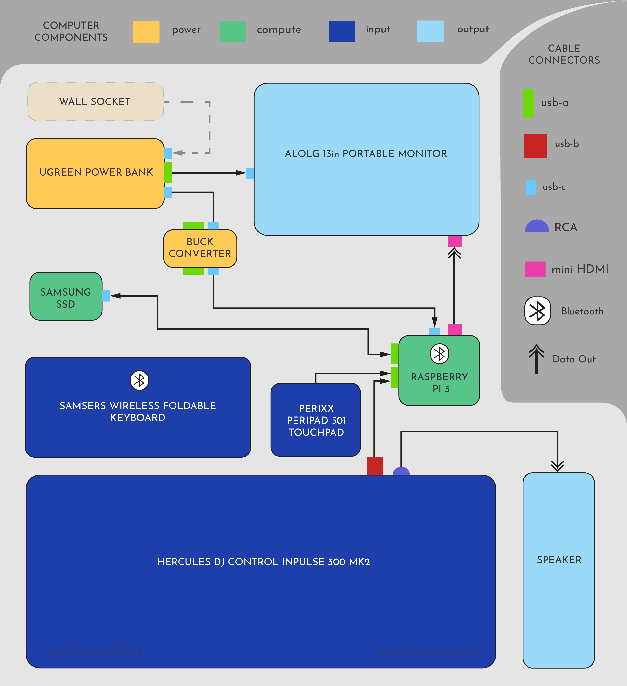

# dj-cyberdeck
Portable DJ set up for DJs, artists, and tech people. This setup uses open source DJ software called Mixxx on a Raspberry Pi. Leave your main laptop at home and take this to any of your gigs!


## Table of Contents
  1. Software List
  2. Components List
  3. Component Diagram
  4. Raspberry Pi OS Setup
  5. Mixxx Setup


## 1. Software List:
  - [Raspberry Pi Imager](https://www.raspberrypi.com/software/)
  - [Mixxx Version 2.6 (with Stems)](https://github.com/mixxxdj/mixxx/tree/2.6)


## 2. Component List:
List of the technical components used in this build and why they were chose. Please note that alternatives are untested but very much worth exploring.

| Tested Component | Reason | Possible Alternatives |
| --- | --- | --- |
| **Raspberry Pi 5 - 16GB** | It is the latest model, but Raspberry Pi 4B successfully booted up Mixxx | Raspberry Pi 5, 8GB; Raspberry Pi 4B, 32GB; Raspberry Pi 4B, 16GB |
| **SD Card - 32GB** | Cheap and sufficient SD card | Any larger SD card |
| **SSD - 1TB** | Room to hold all the music for the DJ Sets | 500GB SSD; 1TB HHD; 500GB HHD |
| **Power Bank - 145W, 25000mAh** | Has 20V/5A profile needed to negotiate down to 5V/5A for the Raspberry Pi; is flight legal | Power Bank, 145W minimum (for 20V/5A), 25000mAh maximum (flight legal) |
| **Buck Converter** | Negotiates power bank's 20V/5A profile down to 5V/5A | Not needed if power bank has a 5V/5A profile |
| **Portable Monitor - 13in** | Laptop size but isn't too big or heavy | Any size monitor; 10in; 15in |
| **TouchPad - Wired** | Wired for no lag; Physical buttons for haptic feedback in a loud room | Computer mouse; Wireless Touchpad |
| **Keyboard - Bluetooth, Foldable** | Bluetooth to free an extra USB-A port on the Raspberry Pi; Wireless lag on typing isn't crucial when DJing, Foldable for storage | Wired Keyboard |
| **DJ Controller - includes Sound Card** | Sound card required for Raspberry Pi setup | Any DJ controller with a sound card |
| **Portable Outdoor Speaker** | Outdoor speakers are louder and have aux or RCA inputs to connect the DJ controller for sound | Large speakers with RCA input |

## 3. Component Diagram:
How all the technical components are connected inside the cyberdeck:



## 4. Raspberry Pi OS Setup
Make sure all peripherals are plugged into the Pi before you turn it on. 

1. To install the Operating system that runs Mixxx (Raspberry Pi OS) onto the Raspberry Pi: Flash the operating system onto the SD card with the Raspberry Pi Imager.
  - Open the Raspberry Pi Imager and select Raspberry Pi 5 and choose the Raspberry Pi OS (64-bit) operating system for the SD card.
  - Set up storage and customization with a username, password, and wifi. Then, enable SSH and remember all of these credentials as they will be used to set up the server

2. `ssh` into the Raspberry Pi (or just open the Raspberry Pi as its own system): 
   To SSH:
  - Ping the **hostname** using the **username** set in the imager settings: `ping hostname.local`
  - Copy IP address that appears in each `ping` and `ssh` into the Raspberry Pi: `ssh username@ip_address`
   
3. Enable Raspberry Pi Wi-fi:
  - Run sudo `raspi-config`, then choose the first option to enter the wifi information
  - `sudo reboot` the Raspberry Pi.

4. Enable Raspberry Pi Bluetooth (optional):
   Only enable if you need bluetooth peripheral like a keyboard, mouse, etc.


5. When you boot the Pi, a desktop interface should show up. There is a command line 
console button (black square with white symbols) in the top left corner of the toolbar. 
Click it to enter the console.
  - From Raspberry Pi desktop console, Install build Mixxx 2.6 dependencies (all one command):
    ```
    sudo apt update
    sudo apt install -y \
      build-essential cmake ninja-build git pkg-config \
      qt6-base-dev qt6-declarative-dev qml6-module-qtquick-controls \
      qt6-svg-dev libqt6opengl6-dev libqt6sql6-sqlite \
      libshout3-dev libtag1-dev libid3tag0-dev libmad0-dev \
      libavcodec-dev libavformat-dev libavutil-dev libswresample-dev \
      libebur128-dev libfftw3-dev libflac-dev libmp3lame-dev \
      libmodplug-dev libopus-dev libopusfile-dev libportmidi-dev \
      librubberband-dev libsndfile1-dev libsoundtouch-dev \
      libusb-1.0-0-dev libvorbis-dev libwavpack-dev \
      libprotobuf-dev protobuf-compiler libchromaprint-dev \
      portaudio19-dev libupower-glib-dev libfaad-dev
      ```
    
## 5. Mixxx Setup
1. Install Mixxx
  - Clone Mixxx and check 2.6 tag
    ```
    git clone https://github.com/mixxxdj/mixxx.git
    cd mixxx
    git tag -l | grep 2.6 // Need version 2.6 or higher for stem support
    ```
Stop after this and check the output before proceeding — we need to confirm the exact repo tag name before checking it out:
git checkout <exact-tag-name>

2. Configure and build:
    ```
    mkdir cmake_build
    cd cmake_build
    cmake .. -DCMAKE_BUILD_TYPE=Release
    cmake --build . -j4
    ```

3. Install:
    ```
    sudo cmake --install .
    
    sudo cp /usr/local/share/mixxx/udev/rules.d/mixxx-usb-uaccess.rules /etc/udev/rules.d/
    sudo udevadm control --reload-rules && sudo udevadm trigger
    ```

4. Run Mixxx:
   `mixxx --controllerDebug //--controllerDebug shows any controller issues in the console `


4. Configure DJ Controller
  - Choose the controller mapping from Mixxx's preferences/options. Find your DJ Controller's mapping online if it is not present inside Mixxx.
  - To import the `.scripts.js` and `midi.xml` mapping files for the **Hercules DJ Control Inpulse 300 Mk2** into the `/.mixxx/controllers` directory on the Raspberry Pi, copy the files from the working directory:
    `cp Hercules_DJControl_Inpulse_300_Mk2_STEMS.midi.xml Hercules_DJControl_Inpulse_300_Mk2.scripts.js /.mixxx/controllers`
  - Copy `midi-components-0.0.js` if it is not already present.
    `cp midi-components-0.0.js /.mixxx/controllers`


## 6. Generating Stems
2. To use stems in Mixxx version 2.6, music has to be imported in its .stem.mp4 form. This means you have to convert your music to a .stem.mp4 file by running the `generate_stem.py`
file.
  - On your computer, NOT your raspberry pi, navigate to your working directory to activate your `venv` and install `requirements.txt`:
      ```
      python3 -m venv venv
      source .venv/bin/activate
      pip install -r requirements.txt
      
      # Try python3 -m pip install -r requirements.txt if that doesn't work
      ```
  - navigate to your music folder/directory. Generate stems:
      ```
      cp generate_stems.py <location_of_music>
      cd <location_of_music>
      source venv/bin/activate
      
      # Run it on one or more files:
      python3 generate_stem.py song1.mp3 
      python3 generate_stem.py song1.mp3 song2.flac song3.wav
      python3 generate_stem.py /path/to/a/folder/of/music -o /stem/mp4/destination/Stems
      ```
    This will generate (or add to) a /Stems folder in the working directory for all the music that is converted. The default destination for the new .stem.mp4 songs is in the /Stems folder in the directory you ran `generate_stem.py` in unless specified otherwise. This conversion will take a LONG time and takes a lot of storage, so consider writing these files directly to the SSD from your laptop to avoid filling your laptop storage. Adding `--device mps` to the end of the `generate_stem.py` commands will speed up stem generation, but it can only be used on a Mac/Apple computer.
    
